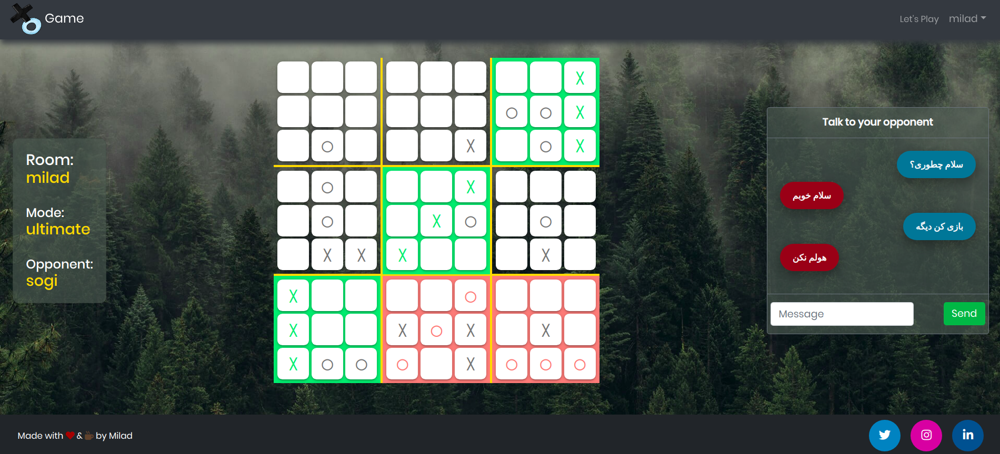

# Multiplayer XO Game Front-End

A real-time two player XO game with chat functionality

Back-end repository:
https://github.com/Miladdarren/aristaeus

Play now:
[Multi-XO](https://melanthios.herokuapp.com)

## Stacks

- **React v16**
- **Redux** for state management
- **Node.js & Express** for back-end
- **MongoDB**
- **Mongoose** as ODM
- **Socket.io** for real-time communication and chat support
- **Passport.js** for authentication by both JWT and Google OAuth strategy
- **Docker** for containerization
- **Travis-CI** as CI/CD
- **Heroku** as host

## NPM Commands

| Command       | Description                                  |
| ------------- | -------------------------------------------- |
| npm install   | Install dependencies                         |
| npm start     | Start development server @**localhost:3000** |
| npm run build | Build react front end in production mode     |
